# Summary3

Author: Zhaojiacheng Zhou

由于整理自matlab英语课程，如果发现中英文有出入，请以英语版本为准

---

## Menu

1. Introduction
2. Cross Validation
3. Reducing Predictors - Feature Transformation
4. Reducing Predictors - Feature Selection
5. Feature Ranking Algorithms
6. Sequential Feature Selection
7. Accommodating Categorical Data
8. Hyperparameter Optimization
9. Fitting Ensemble Models
10. Project1
11. Project2

---

### Introduction


保留一部分数据用于验证模型拟合新数据的效果是一个好的尝试。但不同的分割可能会导致损失估计的改变。


每个算法都有可以修改的属性值，以提高性能。如何为数据集找到最佳属性值？


更简单的模型更容易解释，计算效率更高，不容易过度拟合。如何在不牺牲性能的前提下简化模型?


这章介绍的技术：

- 改进模型精度估计
- 降低模型复杂性
- 训练更精确的模型

---

### Cross Validation

- Intro

    评估模型性能的一个简单方法是将数据分为用于训练模型的子集和用于测试的子集: 用训练集拟合模型，然后使用测试集计算损失。

    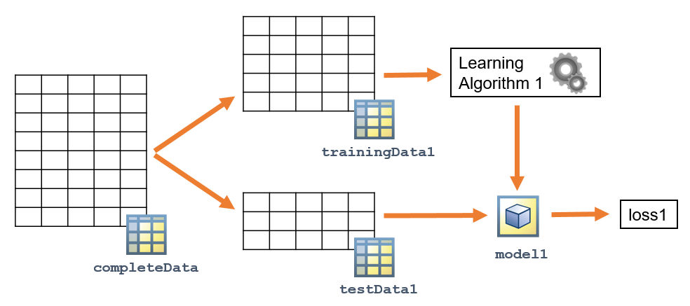

    当你想要选择最好的学习算法或方法时，你可以计算每种方法的损失，并选择损失最小的方法。

    但是，损失是根据数据的特定子集计算的。学习算法可能在特定子集上表现良好，但不能很好地推广到其他数据。

    通过使用交叉验证可以减少对特定测试子集的模型评估的影响。

    交叉验证背后的思想是多次重复模型评估过程。每次，该过程使用不同的训练和测试子集，并将模型拟合到训练集，并使用相应的测试集计算损失。

    

- 算法（k-fold cross validation)

    1. 将数据随机分为k个子集
    2. 将其中一个子集作为验证集，其余作为训练集
    3. 重复k次
    4. 计算loss的平均值

- 重要参数
  - k值

- 使用

  1. 创建CVpartition
  2. 使用CVpartition创建model
  3. 计算k-fold Loss

- Sample Code

    ```matlab
    cvpt = cvpartition(T.faultCode,"KFold",5)
    mdl=fitcdiscr(T,"faultCode","CVPartition",cvpt);
    kfLoss=kfoldLoss(mdl)
    ```

---

### Reducing Predictors - Feature Transformation

- Intro

  机器学习问题通常涉及具有数百或数千个预测因子的高维数据。

  例如:

  - 面部识别问题可能涉及数千个像素的图像，每个像素都可以被视为一个预测因子。
  - 预测天气可能涉及分析数千个地点的温度和湿度测量数据。

  学习算法通常是计算密集型的。减少预测因子的数量可以显著降低计算时间和内存消耗。

  此外，减少预测因子的数量会导致更简单的模型，更容易解释，通常泛化效果更好。

  Feature Transformation通过对观测变量的坐标空间进行变换来减少预测因子

- 算法（PCA)

  主成分分析(PCA)将一个n维特征空间转化为一个新的n维正交分量空间。这些成分是根据数据中解释的变化来排序的。  
  转换后的变量包含与原始数据相同数量的信息。然而，假设数据包含一定数量的噪声，包含解释方差的最后百分之几的分量很可能代表噪声而不是信息。  
  主成分分析可通过丢弃超出一个选定的解释方差阈值主成分来降维。

  主成分本身没有物理意义。然而，线性变换的系数表明了各变量在主成分中的贡献。  
  例如，如果第一主成分的系数分别为0.8、0.05和0.3，则第一个变量的贡献最大，其次是第三个和第二个变量。

- 可视化

  帕累托函数可以用来可视化由主成分解释的方差

  可以使用`biplot`来可视化任意两个主成分（通常为解释了数据中最大的方差的两个主成分）

  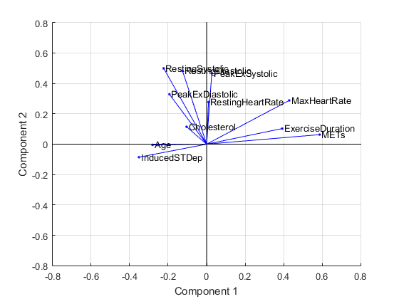

  可以使用heatmap（热力图）来可视化每个变量对主成分的贡献

  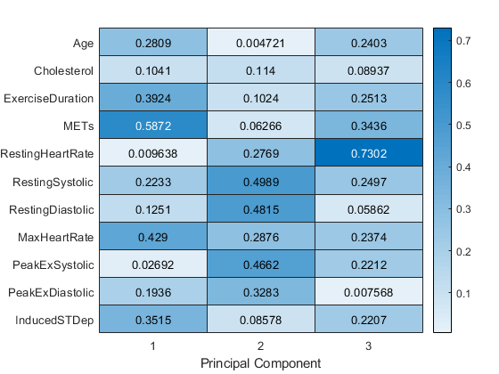

  主成分分析可以独立于对应变量进行。然而，当数据的队友变量具有多个类别(例如，true和false)时，主成分分数的平行坐标图可能很有用

  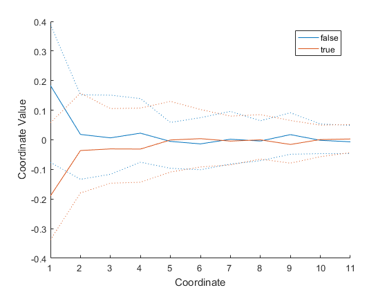

- 使用

  1. 标准化数据（使用zscore）
  2. 将标准化后的数据作为pca的输入
  3. 绘制帕累托图
  4. 寻找能解释要求的百分比的方差（eg.99%)需要多少个主成分
  5. 使用找到的主成分创建模型
  6. 计算loss

- Sample Code

  ```matlab
  T{:,1:end-1}=zscore(T{:,1:end-1});
  [pcs,scrs,~,~,pexp]=pca(T{:,1:end-1});
  pareto(pexp)
  pos=find(cumsum(pexp)>=99,1);
  CVpt=cvpartition(T.faultCode,"KFold",10);
  mdl=fitcnb(PCApreds,T.faultCode,"CVPartition",CVpt);
  mdlLoss=kfoldLoss(mdl);
  ```

---

### Reducing Predictors - Feature Selection

- Intro

  数据集通常包含与响应没有任何关系的预测因子。例如，医疗数据集可能包含患者ID号，但此ID与正在研究的医疗状况没有任何关系。ID不应该包含在模型中，但模型会像对待其他预测因子一样对待它。

  数据集也可能包含高度相关的预测因子，模型中只需要包含其中一个预测因子。

  特征选择技术可以帮助选择要包含在模型中的预测因子子集。

  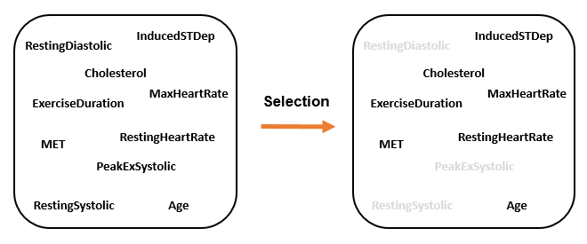

- 应用
  - 决策树内置特征选择方法
    - Grammar:

        predictorImportance(treemodel)

- Sample Code

  ```matlab
  mdl=fitctree(T,"faultCode");
  p=predictorImportance(mdl);
  toKeep=p>0.001;
  selected = T(:,[toKeep true]);
  mdlPart=fitctree(selected,"faultCode","KFold",5);
  partLoss=kfoldLoss(mdlPart);
  ```

  ---

### Feature Ranking Algorithms

- Intro
  - 特征排名算法根据特征与模型的相关性，根据给定的度量标准，为特征分配分数。一些常用的算法包括卡方算法、最小冗余最大相关性算法(MRMR)和邻域成分分析算法。

- 应用

  使用`fs__`函数将特征排序算法应用于数据。大多数特征排序算法返回所有特征从高到低排序的位置和分数。

- Sample Code

  ```matlab
  [idx,scores] = fs__(tblData,ResponseVarName)
  ```

- Inputs

  |tblData|Table data with predictor variables and a response variable.|
  |---|---|
  |ResponseVarName|Name of the response variable.|

- Outputs

  |idx|Indices of predictors ordered by predictor importance.|
  |---|---|
  |scores|Predictor scores.|

- 应用

  1. 使用`fs__`获取索引
  2. 使用线性索引来选择特征的子集
  3. 使用子集来训练模型

- Feature ranking algorithms in MATLAB

  |Algorithm|Function|Task|
  |---|---|---|
  |Chi-Square|fscchi2|Classification|
  |Minimum redundancy maximum relevance (MRMR)|fscmrmr/fsrmrmr|Classification/Regression|
  |Neighborhood component analysis (NCA)|fscnca/fsrnca|Classification/Regression|
  |F-tests|fsrftest|Regression|
  |Laplacian|fsulaplacian|Clustering|
  |ReliefF/RRelief|relieff|Classification/Regression|

- Sample Code

  ```matlab
  [idx,scores]=fscchi2(T,"faultCode");
  bar(idx,scores);
  toKeep = idx(1:15);
  selected = T(:,[toKeep,end]);
  mdlPart = fitctree(selected,"faultCode","KFold",5);
  partLoss = kfoldLoss(mdlPart)
  confusionchart(T.faultCode, kfoldPredict(mdlPart))
  ```

---

### Sequential Feature Selection

- Intro

  顺序特征选择是一种可以用于任何学习算法的特征选择方法。

  顺序特征选择是一个迭代过程，给定一个特定的预测模型，依次添加和删除预测变量，然后评估对模型质量的影响。

- 流程

  1. 顺序特征选择需要一个误差函数来构建模型并计算预测误差。

  

  2. 这个过程首先建立模型，并使用其中一个预测因子计算误差。

  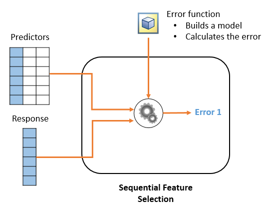

  3. 添加第二个预测因子并再次计算误差。

  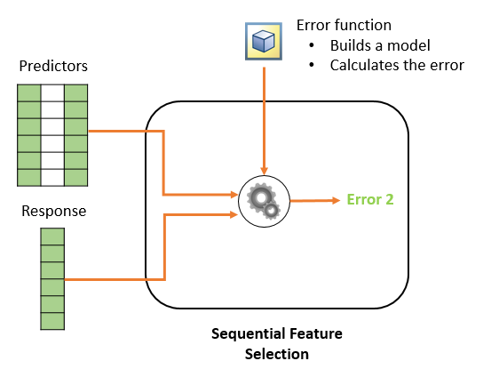

  4. 添加第二个预测因子并再次计算误差。如果误差减小，则保留第二个预测因子。只要误差减小，就会向模型中添加更多的预测因子。

  

- Grammar

  - 使用Function `sequentialfs`

  ```matlab
  toKeep = sequentialfs(fun,X,y)
  ```
  
  - Outputs
    |toKeep|Logical vector indicating which predictors are included in the final model|
    |---|---|

  - Inputs
    |fun|	Function handle for a function that fits a model and calculates the loss.|
    |---|---|
    |X|Numeric matrix with m observations and n predictors.|
    |Y|Numeric vector of m response values.|

  - Tips
    - fun是error function的句柄
    - 以使用可选属性“cv”来指定交叉验证方法

  - Structure of the Error Function

    序列特征选择需要一个误差函数来构建模型并计算预测误差。错误函数必须具有以下结构：
    
    - 四个输入变量
      - 两个训练变量
      - 两个评价变量
    - 表示预测误差的一个标量输出

- Sample Code for error function

  ```matlab
  function error = errorFun(Xtrain,ytrain,Xtest,ytest)
  
  % Create the model with the learning method of your choice     
  mdl = fitcsvm(Xtrain,ytrain);
  
  % Calculate the number of test observations misclassified
  ypred = predict(mdl,XTest);
  error = nnz(ypred ~= ytest);
  
  end
  ```

- Sample Code for `sequentialfs`

  ```matlab
  ferror = @(XTrain,yTrain,XTest,yTest) nnz(yTest ~= predict(fitcknn(XTrain,yTrain),XTest));
  toKeep = sequentialfs(ferror,predictors,data.bin)
  ```

---

### Accommodating Categorical Data

- Intro

  一些算法和功能(例如，sequentialfs)需要数值矩阵形式的预测因子。如果数据包含分类预测因子，如何在模型中包含这些预测因子?

  一种选择是为每个类别分配一个数字。然而，这可能会对观测结果造成错误的数值结构。

  例如，假设你将数字1到4分配到预测因子中的四个类别。这意味着类别1和类别4之间的距离是类别3和类别4之间距离的三倍。实际上，这些类别之间的距离可能是相等的。

  一个更好的方法是创建新的虚拟预测因子，每个类别有一个虚拟预测因子。

- Function `dummyvar`

  可以使用`dummyvar`函数创建一个虚拟变量矩阵,eg.

  ```matlab
  d = dummyvar(c) 
  ```

  d的每一列表示c中的一个类别。每行对应一个观察值，其中有一个元素值为1，其他元素均为0。1出现在与该观察值的指定类别对应的列中。

  这个矩阵现在可以在机器学习模型中使用，取代分类向量c，每一列都被视为一个单独的预测变量，表明该类别c的存在(1)或不存在(0)。

  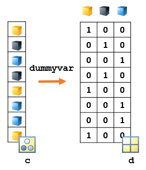

- Sample Code

  ```matlab
  dvGrit=dummyvar(data.grit);
  predictors = [data{:,1:4} dvGrit];
  ferror = @(XTrain,yTrain,XTest,yTest) nnz(yTest ~= predict(fitcknn(XTrain,yTrain),XTest));
  toKeep = sequentialfs(ferror,predictors,data.bin)
  mdlPart = fitcknn(predictors(:,toKeep),data.bin,"KFold",7);
  partLoss = kfoldLoss(mdlPart)
  ```

---

### Hyperparameter Optimization

- Intro

  我们可以修改机器学习模型的属性，以尝试提高模型性能。

  例如，可以将一个kNN模型更改为使用5个最近邻而不是1个，然后计算新模型的损失。

  该过程通常包括用各种属性值反复训练模型，并选择产生最佳精度的组合

  这些属性通常被称为超参数。超参数对模型的性能有很大的影响，但是找到最优的超参数值通常很耗时或很困难。

  为了一次有效地设置所有属性，可以执行超参数优化。超参数优化允许选择模型属性的子集，并为特定的数据集找到最佳设置。
 
- 使用

  可以使用“OptimizeHyperparameters”属性名-值对来选择要优化的模型属性。大多数模型创建函数接受“OptimizeHyperparameters”选项

  eg.

  ```matlab
  mdl = fitcknn(data,"ResponseName","OptimizeHyperparameters",params)
  ```

  - Inputs

    |data,"ResponseName"|Table of predictors and response values and response variable name.|
    |---|---|
    |"OptimizeHyperparameters"|Optional property for hyperparameter optimization.|
    |params|Model properties to optimize, specified as a string array or cell array. Using "auto" and "all" optimizes pre-selected properties.|

  - Outputs

    mdl: Model fit using optimized property values.

  - Tips

    在优化过程中，会显示迭代更新，并显示出最佳目标函数值与迭代次数的关系图

    eg.

    ```matlab
    mdl = fitcknn(data,"y","OptimizeHyperparameters","auto")
    ```

    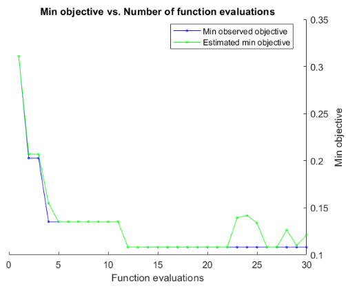

    将“OptimizeHyperparameters”属性值设置为“auto”将优化一组典型的超参数。优化的属性因模型类型而异。例如，对于最近邻分类，优化的属性是“距离”和“NumNeighbors”。

  - 超参选项

    默认情况下，超参数优化使用贝叶斯优化，并尽量减少5倍的交叉验证损失。可以使用“HyperparameterOptimizationOptions”属性名称-值对更改这些设置。

    使用结构指定优化选项。若要使用10倍交叉验证，请创建一个交叉验证分区，然后创建一个包含选项名称-值对的结构。

    ```matlab
    part = cvpartition(y,"KFold",10);
    opt = struct("CVPartition",part);
    mdl = fitcknn(data,"y","OptimizeHyperparameters","auto","HyperparameterOptimizationOptions",opt);
    ```

    可以在结构中设置许多优化选项。例如，可以隐藏图形并设置目标函数计算的最大数量。

    ```matlab
    opt = struct("ShowPlots",false,"MaxObjectiveEvaluations",50); 
    ```

  - Sample Code

    ```matlab
    cvpt = cvpartition(dataTrain.faultCode,"KFold",10);
    opt = struct("CVPartition",cvpt,"MaxObjectiveEvaluations",25);
    ```

---

### Fitting Ensemble Models

- Intro

  一些机器学习方法被认为是弱学习模型，这意味着它们对用于训练它们的数据高度敏感。

  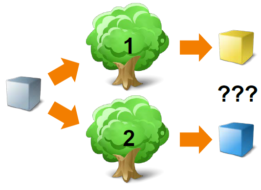

  例如，决策树是弱学习模型;两组略有不同的训练数据可以产生两棵完全不同的树，从而产生不同的预测。

  但是，可以通过创建几棵树(或者按照类似的命名，称为森林)的集合来利用这一弱点。然后，新的观测结果可以应用到所有的树上，并对所得到的预测进行比较。

  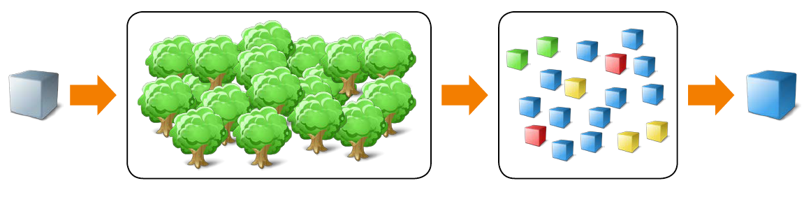

- Grammar

  fitcensemble函数创建了弱学习器的分类集合。类似地，fitrensemble函数创建回归集成。两个函数具有相同的语法。

  ```matlab
  mdl = fitcensemble(data,"ResponseName")
  ```

  - Inputs

    |data|Table containing the predictors and response values.|
    |---|---|
    |"ResponseName"|Response variable name.|

  - Outputs

    |mdl|Ensemble model variable.|
    |---|---|

  - Commonly Used Options
    - "Method" - Bagging (bootstrap aggregation)和boosting是集成建模中最常用的两种方法。fitcensemble函数提供了几种装袋和增强方法。例如，使用“Bag”方法创建一个随机森林。

      ```matlab
      mdl - fitcensemble(data,"Y","Method","Bag")
      ```

      默认方法取决于它是二元还是多类分类问题，以及集成中的学习器类型

    - "Learners" - 可以指定在集成中使用的弱学习器类型:“tree”、“discriminant”或“knn”。默认学习器类型取决于指定的方法:方法“Subspace”有默认学习器“knn”，所有其他方法都有默认学习器“tree”。

      ```matlab
      mdl = fitcensemble(data,"Y","Learners","knn")
      ```

      函数`fitcensemble`使用每种学习器类型的默认设置。要自定义学习器属性，请使用弱学习器模板

      ```matlab
      mdl = fitcensemble(data,"Y","Learners",templateKNN("NumNeighbors",3))
      ```

      可以使用学习器的单元向量来创建由多种类型的学习器组成的集合。例如，一个集成可以由两种类型的kNN学习器组成。

      ```matlab
      lnrs = {templateKNN("NumNeighbors",3),templateKNN("NumNeighbors",5)}
      mdl = fitcensemble(data,"Y","Learners",lnrs)
      ```

    - NumLearningCycles" - 在每个学习周期中，为“learner”中指定的每个学习器训练一个弱学习器。默认学习周期数为100。如果“Learners”只包含一个学习器(通常情况下)，那么默认情况下会训练100个学习器。如果“Learners”包含两个学习器，那么默认情况下训练200个学习器(每个学习周期两个学习器)。

- Sample Code

  ```matlab
  cvpt = cvpartition(T.faultCode,"KFold",5);

  mdlEns=fitcensemble(T,"faultCode","Method","Bag");
  lossEns=resubLoss(mdlEns)

  mdlEns2=fitcensemble(T,"faultCode","Method","Bag","NumLearningCycles",30,"CVPartition",cvpt);
  lossEns2=kfoldLoss(mdlEns2);

  tmdl=templateTree("NumVariablesToSample",15,"Prune","on");
  mdlEns3=fitcensemble(T,"faultCode","Learners",tmdl,"CVPartition",cvpt);
  lossEns3=kfoldLoss(mdlEns3);
  ```

---

### Project1

- Background

  The table redData contains several features of red wine and the corresponding quality, which is saved in the QCLabel variable

- Target

  Reduce the number of predictors in redData. You may use feature selection and/or feature transformation.

  Create a cross-validated model of any type with the reduced data. Name the model mdl, and calculate the loss mdlLoss.

  Try different models to see if you can get the loss value below 0.45, that of the full quadratic discriminant analysis model.

  Feature Selection

  ```matlab
  tModel = fitctree(redData,"QCLabel");
  p = predictorImportance(tModel);

  % View predictor importance on a bar plot
  bar(p)
  xticklabels(redData.Properties.VariableNames(1:end-1))
  xtickangle(60)

  % Sort out the top predictors
  [~,iSorted] = sort(p);
  selected = [iSorted(1:6) width(redData)];

  % Create tree model to reduced data
  mdl = fitctree(redData(:,selected),"QCLabel","KFold",7);
  mdlLoss = kfoldLoss(mdl)
  ```

  PCA

  ```matlab
  [pcs,scrs,~,~,pexp] = pca(redData{:,1:end-1});
  pareto(pexp)

  % Create k-NN model to reduced data
  mdl = fitcknn(scrs(:,1:3),redData.QCLabel,"KFold",7);
  mdlLoss = kfoldLoss(mdl)
  ```

---

### Project2

- Background

- Task1

  - Target

    Create a reduced data set with three or fewer predictor variables. You may use feature selection and/or feature transformation. Then, create a seven-fold cross-validated tree model named mdl and calculate the loss, mdlLoss.

  - Code
    ```matlab
    p=predictorImportance(fitctree(creditRatings,"Rating"));
    [~,sorted]=sort(p);
    selected=[sorted(1:3),width(creditRatings)];
    cvpt=cvpartition(creditRatings.Rating,"KFold",7);
    mdl=fitctree(creditRatings(:,selected),"Rating","CVPartition",cvpt);
    mdlLoss=kfoldLoss(mdl);
    ```

- Task2

  - Target

    Create an ensemble of 50 seven-fold cross-validated classification trees using the bag method. Create your model with three or fewer predictors selected from the previous task. Name the ensemble mdlEns. Calculate the loss and name it lossEns.

  - Code

    ```matlab
    mdlEns=fitcensemble(creditRatings(:,selected),"Rating","Method","Bag","NumLearningCycles",50,"CVPartition",cvpt);
    lossEns=kfoldLoss(mdlEns);
    ```
