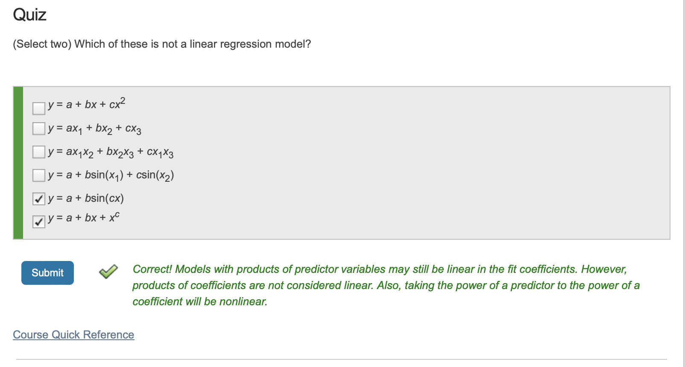
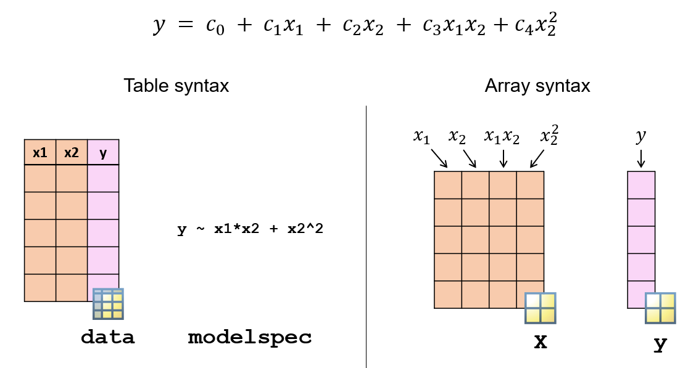
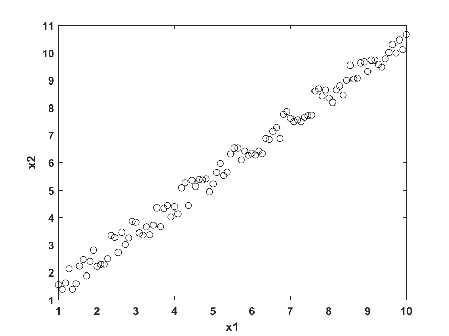
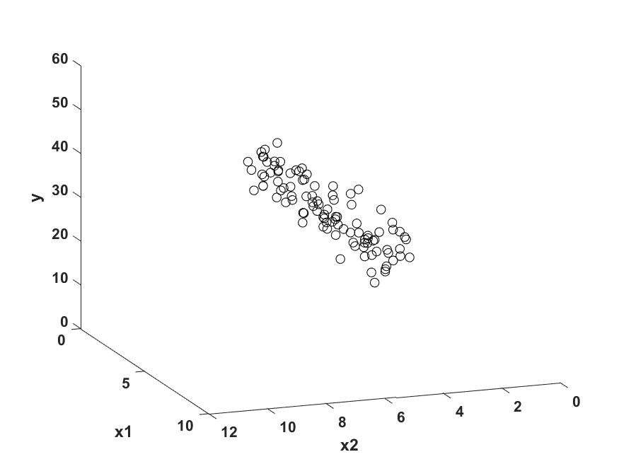
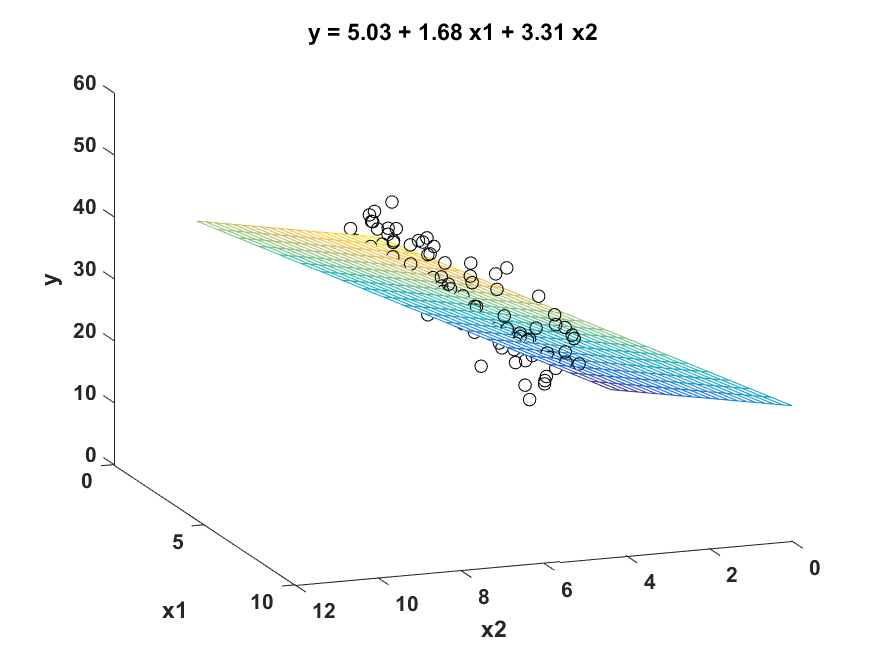
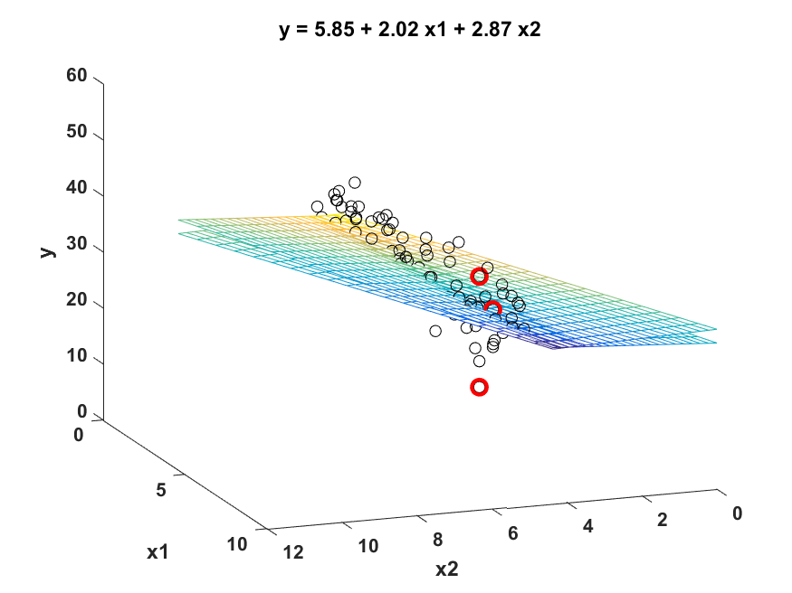
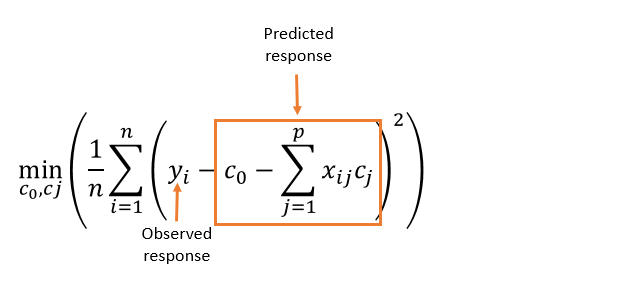
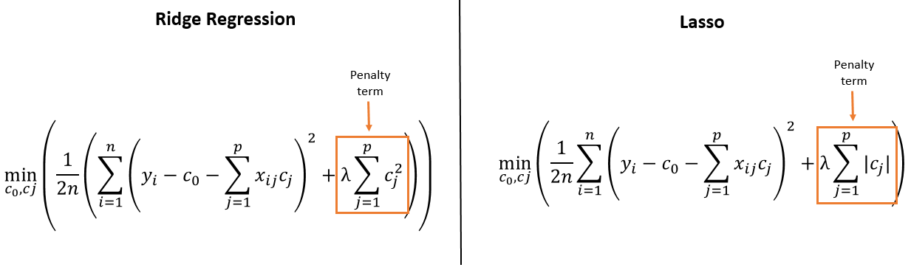
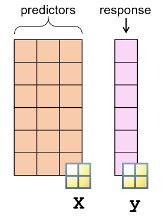
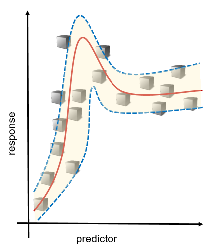

# Summary4

Author: Zhaojiacheng Zhou

由于整理自matlab英语课程，如果发现中英文有出入，请以英语版本为准

---

## Menu

1. Introduction
2. Linear Models
3. Stepwise Linear Regression
4. Regularized Linear Models
5. SVMs, Trees and Neural Networks
6. Gaussian Process Regression

---

### Introduction

回归算法是一种有监督算法，用来建立“解释”变量(自变量X)和观测值(因变量Y)之间的关系；从机器学习的角度来讲，用于构建一个算法模型(函数)来做属性(X)与标签(Y)之间的映射关系，在算法的学习过程中，试图寻找一个函数 使得参数之间的关系拟合性最好。

回归算法中算法(函数)的最终结果是一个连续的数据值，输入值(属性值)是一个d维度的属性/数值向量

---

### Linear Models

- Intro

    线性回归是最简单但最强大的回归技术之一。这是一种参数回归技术，其中响应被建模为预测变量给出的一些已知公式。

    例如，可以使用以下公式将线性回归模型与燃油经济性数据拟合：

    $$ Fuel\space Economy=c_0+c_1*Weight+c_2*Horse\space Power+c_3*Axle\space Ratio$$

    在该模型中，燃油经济性是响应变量，而重量、马力和轴比是预测变量。

    拟合过程找到系数c0, c1, c2和c3，使预测误差最小化。

- Formula

    $$y=\displaystyle \sum_{k=0}^nc_k f_k\left(x_1,x_2\right)$$

    y是对应值，$x_1,x_2$是预测因子

- Grammar

    使用函数`fitlm`拟合线性回归模型

    ```matlab
    mdl = fitlm(data,"modelspec")
    ```

    

- Inputs

    |data|A table containing the data used to fit the regression model. See below for details.|
    |---|---|
    |"modelspec"|Specification of the regression model. See below for details.|

- Outputs

    |mdl|A regression model variable containing the coefficients and other information about the model.|
    |---|---|

- Tips

    fitlm的第一个输入是一个包含预测因子和对应值。默认情况下，fitlm使用最后一列作为对应值，所有其他列作为预测因子

    在对线性回归建模时，可以对预测变量应用不同的函数。作为fitlm的第二个输入，可以使用一个预定义模型，也可以通过提供Wilkinson-Rogers表示法的公式来指定一个模型。

- Quiz

    

- Predefined Model

    |Model name|Meaning|
    |---|---|
    |"linear"|Intercept and linear terms for each predictor.|
    |"interactions"|Intercept, linear terms, and all products of pairs of distinct predictors (no squared terms).|
    |"quadratic"|Intercept, linear terms, interactions, and squared terms.|

- Wilkinson–Rogers notation: **responseVar ~ terms**

    |Operator|Meaning|Exampl|
    |---|---|---|
    |+|Include this term|"y ~ x1+x2"includes the intercept term(截距式), x1, and x2: $y = c_0 + c_1 x_1 + c_2 x_2$|
    |-|Exclude this term.|"y ~ x1+x2-1" excludes the intercept term: $y = c_1 x_1 + c_2 x_2$|
    |\*|Include product and all lower-order terms.|"y ~ x1\*x2" includes the intercept term, x1, x2, and x1*x2: $y = c_0 + c_1 x_1 + c_2 x_2 + c_3 x_1 x_2$|
    |:|Includes the product term only.|"y ~ x1:x2" includes only x1*x2:y = c1 x1 x2|
    |^|Include power and all lower-order terms.|"y ~ (x1^2)+(x2^2)" includes the intercept, x1, x2, x1^2, and x2^2: $y = c_0 + c_1 x_1 + c_2 x_2 + c_3 x_1^2 + c_4 x_2^2$|

- Sample Code

  - Basic

      ```matlab
      mdl = fitlm(dataTrain,"quadratic","RobustOpts","on")
      yPred = predict(mdl,dataTest);
      ```

  - Modify the code so that mdl fits a model where the response Y is a function of X1, X1^2, and X3.

      ```matlab
      mdl=fitlm(dataTrain,"Y~X1+X1^2+X3");
      yPred=predict(mdl,dataTest);
      ```

- Specify the Regression Model

    预测矩阵X的每一列都被视为一个预测变量。默认情况下，fitlm将为每个预测器(列)拟合一个具有截距和线性项的模型。

    要拟合不同的回归公式有两个选择。
    1. 可以将预测器和响应存储在一个表中，并分别提供模型规范。
    2. 可以为回归公式中的每个项创建一个带有列的矩阵。这个矩阵叫做设计矩阵。

    

  - Sample Code for Design Matrix

    ```matlab
    XTrain13 = [XTrain(:,1),XTrain(:,3),XTrain(:,1).*XTrain(:,3)];
    dl13 = fitlm(XTrain13,yTrain)
    ```

  - Visualize the Result

    使用函数`evaluateFit`可视化模型

    ```matlab
    mdl = fitlm(carTrain,"RobustOpts","cauchy");
    econPred = predict(mdl,carTest);
    evaluateFit(carTest.FuelEcon,econPred,"Linear Model")
    ```

    

---

### Stepwise Linear Regression

- Intro

    在拟合线性回归模型时，可以使用无限多的模型规范。
    如何选择能创建最佳模型的模型规范?当你有大量的预测器时，这个问题会变得更糟。

    逐步线性回归通过选择预测变量的子集及其多项式函数来创建紧凑模型。

    注意`stepwise`仅在基础模型为线性回归时使用。对于非线性回归和分类问题，使用`sequentialfs`

- Grammar

    使用`stepwiselm`函数拟合线性回归模型

    ```matlab
    stepwiseMdl = stepwiselm(data,"modelspec")
    ```

  - Inputs

    |data|A table containing the data used to fit the regression model. See below for details.|
    |---|---|
    |"modelspec"|Starting model for the stepwise regression (see below).|

  - Outputs

    |stepwiseMdl|A linear model variable containing the coefficients and other information about the model.|
    |---|---|

  - Specify a Model
    可以通过以下输入来控制模型选择过程

    - "modelspec"——函数的第二个输入：指定起始模型。

      `stepwiselm`从这个模型开始，并根据某些标准添加或删除项。  
      常用的起始值:“constant”、“linear”、“interactions”(常数、线性、相互作用项)、“quadratic”(常数、线性、相互作用、二次项)。

    - "Lower" and "Upper"

      如果希望限制模型的复杂性，请使用这些属性。例如，下面的模型肯定包含截距和线性项，但不包含任何三次或三次以上的项

      ```matlab
      mdl = stepwiselm(data,"Lower","linear","Upper","quadratic") 
      ```

      默认情况下，`stepwiselm`认为模型简单如仅包含常数项或复杂如包含相互作用项

  - 选择模型

    如果修改后的模型比前一次迭代更好，则`stepwiselm`将迭代地从开始的模型中添加和减去项。

    “Better”是根据“Criterion”属性的值来判断的。默认值是“sse”——一个误差平方和的f检验。您可以通过设置“Criterion”属性来更改此选项。

    - Sample Code

      ```matlab
      mdl = stepwiselm(data,"Criterion","rsquared")
      ```
  
    可选值: "sse" (default), "aic", "bic", "rsquared", "adjrsquared"

  - Tips

    与`fitlm`一样，`stepwiselm`使用数据的最后一列作为响应，所有其他列作为预测因子。

  - Sample Code

    ```matlab
    mdl=stepwiselm(dataTrain,"purequadratic");
    yPred=predict(mdl,dataTest);

    % Extract the model formula 
    formula=mdl.Formula;
    ```

---

### Regularized Linear Models

- Intro

    当一个数据集有大量的预测因子时，选择正确的参数回归模型可能是一个挑战。包括所有的预测因素会创建一个不必要的复杂模型，而且一些预测因素可能是相关的。

    用线性回归模型拟合这类数据可以得到方差较大的系数。即训练数据稍有变化，系数值变化较大。

    

    考虑相关的预测因子x$_1$,x$_2$

    

    假定response，y,取决于x$_1$,x$_2$

    

    可以使用线性回归模型拟合数据

    

    理想情况下，该模型对训练数据的轻微变化具有鲁棒性。
    假设一些训练数据点发生了轻微的变化。

    

    当一个线性回归模型适合新的数据时，可以直观地观察到新模型与旧模型有很大的不同。

  - 正则化

    正则化线性回归模型通过对较大的系数值施加惩罚来缩小回归系数。这减少了系数的方差，并可以创建预测误差较小的模型。

    

    这是原始训练数据的正则化线性回归模型。这些系数与线性模型中的系数相似。

    

    在训练数据发生轻微变化后，可以观察到正则化回归模型的系数变化不大。

  - Ridge and Lasso Regression

    在线性回归中，系数由最小化均方误差(MSE)选择。均方误差是观测值与预测响应值之间的差的平方。

    

    在ridge和lasso回归中，在MSE中加入一个惩罚项。

    该惩罚项由拟合系数值和调整参数λ组成。λ的值越大，惩罚就越大，因此，系数就越“缩小”到零

    

  - 惩罚项

    这两种方法的不同之处在于惩罚期限的计算方式。岭回归使用系数的L2范数。Lasso使用L1范数。

    使用不同的规范可以提供不同的正则化行为。

    岭回归不断缩小系数，并保持所有的预测。  
    Lasso允许将系数设置为零，从而减少模型中包含的预测因子的数量。

    Lasso可以用作特征选择的一种形式，但是特征选择可能不适用于具有相似的、高度相关的变量的情况。这可能会导致信息丢失，从而影响结果的准确性和解释。岭回归保持了所有的特征，但如果有大量的预测因子，模型可能仍然非常复杂。

  - 弹性网

    还可以使用两者加权平均值的惩罚项。这是弹性净回归，它引入了另一个参数-岭回归(L$_2$范数)和Lasso回归(L$_1$范数)之间的加权

  - Grammar of Ridge Regression Models

    使用函数`ridge`来拟合岭回归模型

    ```matlab
    b = ridge(y,X,lambda,scaled)
    ```

    
    - Inputs

      |y|Response values, specified as a vector.|
      |---|---|
      |X|Predictor values, specified as a numeric matrix.|
      |lambda|Regularization parameter.|
      |scaled|A {0,1}-valued flag to determine if the coefficient estimates in b are restored to the scale of the original data.|

    - Outputs

      |b|Ridge regression coefficients.|
      |---|---|

    - Notes

      - 矩阵X是一个数值设计矩阵，列表示回归公式中的项。如果原始数据包含两个预测变量x1和x2，但所需的回归模型公式包含术语x1、x2和x1*x2，则矩阵X应该有3列:x1、x2和x1*x2。
      - `ridge`的参数`lambda`是非负数。在后面的部分中，您将尝试估计`lambda`的最佳值。
      - `ridge`拟合模型之前将对预测因子进行归一化。因此，默认情况下，回归系数对应归一化数据。将`scaled`标志设置为0以将系数恢复到原始数据的比例

  - Predicting Response using Ridge Regression Models

    当使用岭回归模型进行预测时，将需要原始数据尺度内的回归系数。在这种情况下(缩放标志设置为0)，系数向量b将包含n+1个具有n个预测因子的模型系数。b的第一个元素对应截距项。

    可以通过将包含预测因子和系数向量的最后n个元素的矩阵相乘来预测对应值。加上系数向量的第一个元素，将截距纳入计算。

    

  - 选择lambda

    当向岭函数提供λ值的向量时，输出b是一个系数矩阵。

    ```matlab
    b = ridge(y,X,lambda,scaling);
    ```

    b的列包含向量lambda中每个参数的系数值。

    

    可以使用矩阵b的每一列作为回归系数并预测对应值

    ```matlab
    yPred = dataNew*b(2:end,:) + b(1,:);
    ```

    

    对应值yPred是一个矩阵，其中每一列都是对应lambda值的预测响应。可以使用yPred来计算均方误差(MSE)，并选择使MSE最小化的系数。

  - Sample Code for Ridge

    ```matlab
    lambda=0:100;
    b = ridge(yTrain,XTrain,lambda,0);
    plot(lambda,b)
    yPred=XTest*b(2:end,:)+b(1,:);
    err = yPred - yTest;
    mdlMSE = mean(err.^2);
    plot(lambda,mdlMSE)
    xlabel("\lambda")
    ylabel("MSE")
    [minMSE,idx]=min(mdlMSE)
    ```

  - Grammar for Lasso Regression Models

    ```matlab
    [b,fitInfo] = lasso(X,y,"Lambda",lambda)
    ```

    - Inputs

      |X|Predictor values, specified as a numeric matrix.|
      |---|---|
      |y|Response values, specified as a vector.|
      |"Lambda"|Property name for specifying the regularization parameter.|
      |lambda|Regularization parameter value.|

    - Outputs

      |b|Lasso coefficients.|
      |---|---|
      |fitInfo|A structure containing information about the model.|

    - Notes

      与ridge一样，矩阵X是一个设计矩阵，列表示回归公式中的项。

      “Lambda”属性是可选的。如果未指定，Lasso使用的基于数据的$\lambda$等比数列。

      Ridge和lasso执行它们的惩罚条件略有不同，因此，对lambda使用不同的缩放。要使用lasso中的λ值，其解释与岭回归的λ值相同，请将lasso中的λ按观测次数缩放。

      使用值在0到1之间的可选属性“Alpha”创建弹性网。弹性净回归使用的惩罚项是脊(L2)和lasso(L1)惩罚项的加权平均值。接近1的“Alpha”值更接近lasso，接近0的“Alpha”值更接近山脊。

  - Predicting Response using Lasso Model

    以通过将包含预测因子的矩阵乘以系数向量来预测响应。

    请注意，截距项不包括在输出系数中。相反，它是输出结构fitInfo中的一个字段。

    ```matlab
    yPred = dataNew*b + fitInfo.Intercept
    ```

  - Sample Code

    ```matlab
    lambda = (0:100)/length(yTrain);
    [b,fitInfo] = lasso(XTrain,yTrain,"Lambda",lambda,"Alpha",0.4);
    plot(lambda,[fitInfo.Intercept;b],"LineWidth",2)
    legend("intercept","X1","X2")
    xlabel("\lambda")
    yPred = fitInfo.Intercept + XTest*b;
    mdlMSE = mean((yTest - yPred).^2);
    [minMSE,idx] = min(mdlMSE)

    plot(lambda,mdlMSE)
    xlabel("\lambda")
    ylabel("MSE")
    ```

  - Sample Code

    ```matlab
    lambdaR = 0:300;
    bR = ridge(econTrain,XTrain,lambdaR,0);
    econPredR = bR(1,:) + XTest*bR(2:end,:);
    err = econPredR - econTest;
    MSER = mean(err.^2);
    [minMSER,idxR] = min(MSER)

    plot(lambdaR,MSER)
    xlabel("\lambda")
    ylabel("MSE")
    title("Ridge model")
    lambdaL = (0:300)/length(econTrain);
    [bL,fitInfo] = lasso(XTrain,econTrain,"Lambda",lambdaL);
    econPredL = fitInfo.Intercept + XTest*bL;
    err = econPredL - econTest;
    MSEL = mean(err.^2);
    [minMSEL,idxL] = min(MSEL)

    plot(lambdaL,MSEL)
    xlabel("\lambda")
    ylabel("MSE")
    title("Lasso model")
    ```

---

### SVMs, Trees and Neural Networks

- Intro

  像`fitlm`这样的线性回归技术是参数化的，这意味着预测是基于从训练数据中估计的有限参数集。

  参数回归模型特征:

  - 假设可以使用公式指定的关系。  
  - 很容易解释-你可以在预测因子中测量每单位变化的对应值变化

  如果模型的主要目的只是预测未知观测结果的对应值，则可能不需要具有特定可解释公式的模型。在这种情况下，您可以使用非参数模型。

  非参数回归模型:

  - 不适合基于给定公式的回归模型。
  - 可以提供更准确的预测，但更难以解释

  支持向量机(svm)、决策树和神经网络是一些可以用于回归的非参数技术。

- Grammar

  与fit___一致

---

### Gaussian Process Regression

- Intro

  高斯过程回归(GPR)是另一种非参数回归技术。

  除了预测给定预测值的响应值外，GPR模型还可选择返回标准偏差和预测区间。

  

  GPR将GMM的中数字的分布概率延伸至方程的分布概率

  当我们对一个n维正态分布取样，我们会得到n个数。通常我们会把这些数据视为n维空间中的一个点。但是我们也认为它们是一个方程在n个点上的采样取得的值

  如果我们让n的值变得越来越大，我们就可以更好地分辨函数。

  理论上，方程是一个在无限维空间中的一个点。但一个极大的n足够我们解决实际问题

  在无限维空间上的一个点可以用由一个期望向量和一个协方差矩阵决定的概率分布采样。相似的，我们可以通过由期望向量方程和一个协方差方程决定的概率分布

  GPR中协方差方程是由一个选定的核函数决定的。该核函数描述了一个点对另一个点有多大的影响。这有效的决定了分布中方程的光滑程度。

  在获得一组点的情况下，我们可以通过选择分布参数，用一个概率分布来拟合这些点，使得分布的属性匹配数据的属性

  类似的，在获得一组方程值的情况下，我们可以用一个非常接近给定方程值的方程概率分布来拟合。我们可以获得期望和置信区间。这不仅给出了回归方程，还给出了预测的概率边界

- Grammar

  ```matlab
  mdl = fitrgp(data,"ResponseVarName")
  ```

  - Inputs

    |data|A table containing the predictor and response values.|
    |---|---|
    |"ResponseVarName"|Name of the response variable.|

  - Outputs

    |mdl|A GPR model variable.|
    |---|---|

  - Predicting the Response

    除了预测的响应值，GPR模型的预测函数还可以返回预测值的标准差和预测区间

    ```matlab
    [yPred,yStd,yInt] = predict(mdl,dataNew)
    ```

    yPred: Predicted response value(s).  
    yStd: Standard deviation for each predicted value.  
    yInt: Matrix whose columns contain the lower and upper limits of the 95% prediction interval for each predicted value.

    以通过将“Alpha”属性设置为0到1之间的值来更改预测间隔的显著水平。默认值为0.05

    ```matlab
    [yPred,yStd,yInt] = predict(mdl,dataNew,"Alpha",0.01)
    ```

- Sample Code

  ```matlab
  mdl = fitrgp(dataTrain,"y");

  yPred = predict(mdl,dataTest);
  mdlMSE = loss(mdl,dataTest)
  ```

  ```matlab
  mdl = fitrgp(dataTrain,"y");
  [yPred,~,yInt] = predict(mdl,dataTest);
  ```
