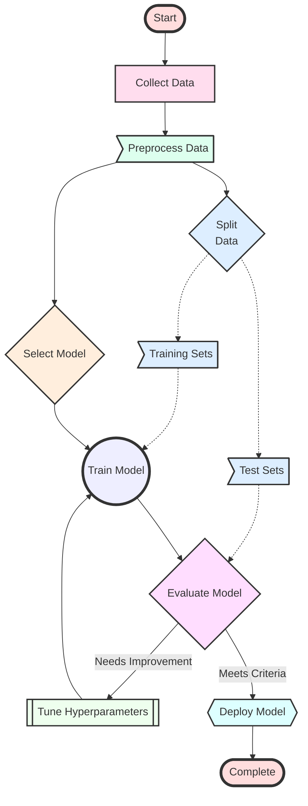

# Machine Learning

## general workflow

[sklearn-datacamp cheatsheet](https://images.datacamp.com/image/upload/v1676302389/Marketing/Blog/Scikit-Learn_Cheat_Sheet.pdf)

### choice of Model
[SAS cheatsheet](https://blogs.sas.com/content/subconsciousmusings/2020/12/09/machine-learning-algorithm-use/)
[sklearn cheatsheet](https://scikit-learn.org/stable/tutorial/machine_learning_map/index.html)
[datacamp cheatsheet](https://s3.amazonaws.com/assets.datacamp.com/email/other/ML+Cheat+Sheet_2.pdf)
[azure cheatsheet](https://learn.microsoft.com/en-us/azure/machine-learning/algorithm-cheat-sheet?view=azureml-api-1)

## docs

[ml glossary](https://ml-cheatsheet.readthedocs.io/en/latest/index.html) (WIP)

